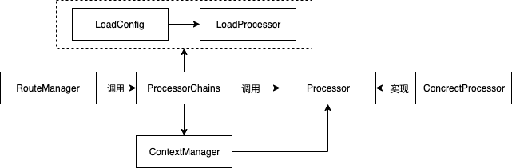

# python_service_framework

## 背景
对于各种模型预测service，包括搜索在线，网页分析等，目前都是各人按各人的想法设计代码结构和数据结构。这样存在的问题有：  

1. 缺少写代码的规范，设计、开发、迭代和维护成本都很高，效率低。
2. 代码功能难以复用。

为了解决以上问题，应该有一个编程框架，大家都按照统一的编程框架来开发。

## 框架设计

### 框架架构图

### 名词解释
processor：  
一个逻辑的最小单位，比如对于网页抽取服务，编码转换可以作为一个processor，建dom树可以作为一个processor.

processor\_dag/processor\_chain：  
processor\_dag是一个有向无环图，图的每个节点是一个processor，表明各processor执行的先后顺序。可以有多个processor\_dag.  
processor\_chain是一个链，链的每个节点是一个processor，表明各processor执行的先后顺序。可以有多个processor\_dag.

context：  
用于存储数据的上下文信息。比如对于网页抽取服务，网页原始信息(html, url)可以作为一个context，模板匹配的信息作为一个context.

context\_manager：  
管理所有的context.

route\_manager：  
根据输入决定走哪一个processor_dag.

### 框架工作流程
外部请求首先走到route\_manager，由route\_manager确定走哪一个processor\_dag，在processor\_dag内部，根据预先设定好的dag走完各processor， 各processor之间的信息交互通过context\_manager.

## 使用说明

### 框架使用说明

`from python_service_framework.frameworks import * `

依赖导入完成后继承处理类[Processor](python_service_framework/frameworks/processor.py)，实现init逻辑并编写单元处理逻辑的方法process。

调用是定义一个执行路径[RouteManager](python_service_framework/frameworks/route_manager.py)类，指定配置文件地址并执行route的process方法即可完成链式调用。

调用示例代码：[run.py](python_service_framework/run.py)

### 配置文件编写说明

配置文件为Json格式。顶层包含三个元素，分别为processors，input和output。

- input包含元素name和type
    - input.name：规定输入的系统名称，可以在上下文中用该名称获取输入。名称必须大于两个字符，且不包含"."和"-"。
    - input.type：枚举值，可以定义为single或者list。代表系统的输入是单个值还是一个数据列表。
- output只包含元素type
    - output.type：枚举值，可以定义为single或者list。代表要获取的系统输出是单个值还是一个数据列表。
- processors是一个列表，列表内的元素包含name，path，args
    - processors.*.name：processor的名称，可以在上下文中用该名称获取输入。名称必须大于两个字符，且不包含"."和"-"。
    - processors.*.path：processor对应类的路径，一般来说，是相对于项目根目录的路径。
    - processors.*.args：定义了一下参数，可以在对应的类的初始化函数里通过kwargs参数获取其值。

### 自定义类编写说明

- 自定义类必须继承自基类python_service_framework.frameworks.processor。 
- 自定义类必须实现基类中的\_\_init\_\_()和process()方法。其中init只会初始化一次，数据处理逻辑写在process中。
- init函数参数为(name, **kwarg)，其中name为定义的processor名称，kwargs可以获取配置文件中的args配置参数。
- process函数的输入参数为(inputs, context=None)
    - 其中inputs为传入的要处理的数据，它是一个列表，真正要处理的的数据条目存在列表中。
    - context为上下文，必须有默认值定义，可以在函数中通过该参数获取程序的上下文，它是一个python_service_framework.frameworks.ContextManager类型的参数。
- process函数的返回值必须是一个二元组：(output, class_name)
    - 其中outputs是一个列表，列表中包含处理过的数据。
    - class_name正常情况下一般为process.name，主要用途是为了在告诉调用者对应的outputs是哪个processor产生的。它还有一个特殊用途，如果返回的class_name为Config.DIRECT_RETURN_CLASS_NAME，则不再执行后续的执行链路，直接将该processor的返回值作为系统返回值。
